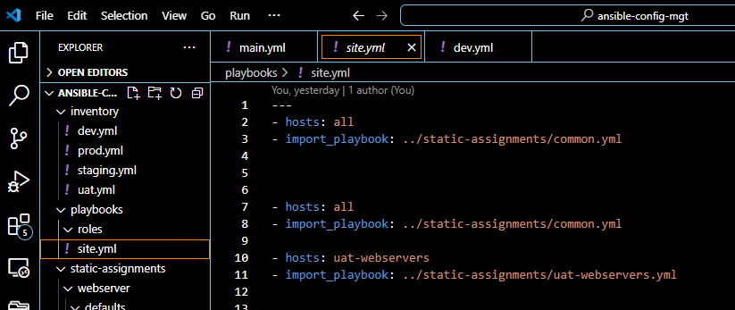
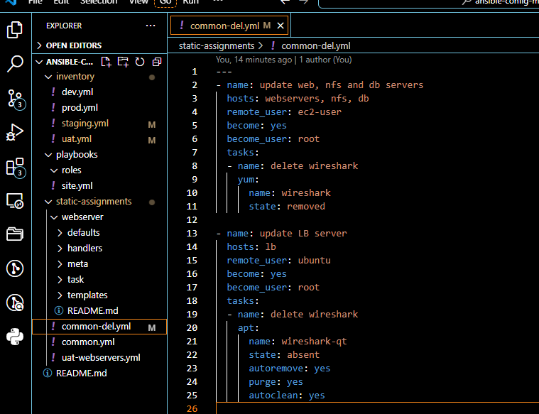
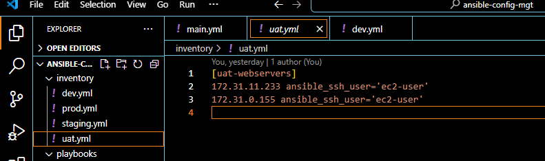

# ANSIBLE REFACTORING-ASSIGNMENTS AND IMPORTS

## -Introduction
### We were made to understand that ansible can be used to automate virtually any task.
### Refactoring is the process of restructuring existing code to improve efficiency and maintain functionality. Benefits of refactoring include improved readability, reduced complexity, better team collaboration, and a higher quality product.

### In computer programming and software design, code refactoring is the process of restructuring existing computer code—changing the factoring—without changing its external behavior. Refactoring is intended to improve the design, structure, and/or implementation of the software, while preserving its functionality.

## What Is Refactoring, Assignment And Imports: 

### The project revolves around enhancing Ansible playbooks through refactoring without  changing its external behavior, assignments, and imports. Refactoring involves restructuring existing code to improve readability and maintainability, while assignments allow dynamic data handling within playbooks. Imports, on the other hand, facilitate modularization by incorporating external playbooks  into the main automation script.

### Importance Of Refactoring Assignment And Imports
1.Refactoring improves the design of software, makes software easier to understand, helps us find bugs and also helps in executing the program faster. 
2.Refactoring for restructuring an existing body of code, altering its internal structure without changing its external behavior.
3.Refactoring improves internal code structure without altering its external functionality by transforming functions and rethinking algorithms.
4.Refactoring is an iterative process, which include reducing scope, replacing complex instructions with simpler or built‐in instructions, and combining multiple statements into one statement. 
5.When the code is transformed with refactoring techniques it will be faster to change, execute, and download. It is an excellent best practice to adopt for programmers wanting to improve their productivity. 
6.Refactoring also helps us find bugs when we are trying to fix a bug in difficult‐to‐understand code. By cleaning things up, we make it easier to expose the bug.
7.Refactoring improves the quality of application design and implementation.

### In general, three cases concerning refactoring. Iterative refactoring, Refactoring when is necessary, Not refactor.

### Types of Refactoring: There are 3 types of refactoring
1.Code refactoring: It often referred to simply as refactoring. This is the refactoring of  programming source code.
2.Database refactoring: It is a simple change to a database schema that improves its design while retaining both its behavioral and informational semantics.
3.User interface (UI) refactoring: It is a simple change to the UI which retains its semantics.

### Target Audience  

### Refactoring is majorly used by Software developers, DevOps services experts, and computer programmers use code refactoring to enhance and modify software design, organization, and deployment.

### This project is tailored for DevOps engineers seeking to optimize Ansible playbooks. Familiarity with basic Ansible concepts is recommended. Users should have a foundational understanding of YAML, as Ansible playbooks are written in this format.

## Project Prerequisite: 
- Git-hub knowledge
- Virtual studio code experienced
- Jenkins
- Aws virtual servers’ creation understanding

### Basic knowledge of Ansible concepts and YAML syntax. Understanding of inventory files and host configurations. Knowledge in running Ansible commands and playbooks. Completion of the previous project Ansible Automate.

### Project Goals

• Understand the principles of refactoring Ansible playbooks for improved readability and maintainability.
• Learn dynamic data handling techniques within Ansible playbooks for adaptable automation.
• Master the art of modularization by incorporating external playbooks and roles into main Ansible scripts.
• Combine refactoring, assignments, and imports to create well-organized and efficient Ansible automation solutions.

### Project Highlight

Refactor Ansible Code By Importing Other Playbooks Into site.yml
o	Jenkins Job Enhancement
o	Refactor Ansible Code By Importing Other Playbooks Into site.yml
o	Configure UAT Webservers With A Role "Webserver"
o	Reference "Webserve" Role
o	Commit And Test

### Refactor Ansible Code By Importing Other Playbooks Into site.yml

## Step 1: 
### Jenkins Job Enhancement
### In the previous project (ansible automate projects) we create a jenkins build job, we are going to  make some changes to our Jenkins job. 

### In the last project,(project 11) every new changes in the codes and every commit jobs on git-hub creates a separate directory which is not very convenient when we want to run some commands from one place. It also consumes space on Jenkins server with each subsequent change.

### Let us enhance it by introducing a new Jenkins project/jobs - we will require Copy Artifact plugin.

### Go to your Jenkins-Ansible server on the terminal and create a new directory called ansible-config-artifact - we will store there all artifacts after each build.

### Run below command

'sudo mkdir /home/ubuntu/ansible-config-artifact'

### Change permissions to this directory, so Jenkins could save files there.

### Run below code

'chmod -R 0777 /home/ubuntu/ansible-config-artifact'

### Go to Jenkins web console  and perform below tasks

### web console -> Manage Jenkins -> Manage Plugins -> on Available tab search for Copy Artifact and install this plugin without restarting Jenkins.
### Now we will create a new Freestyle project as it was done initially in ansible automate project and name it save_artifacts. Make sure it is connected to ansible-config-mgt repository.
### This project will be triggered by completion of your existing ansible project. Configure it accordingly
### The main idea of save_artifacts project is to save artifacts into /home/ubuntu/ansible-config-artifact directory. To achieve this, create a Build step and choose Copy artifacts from other project, specify ansible as a source project and /home/ubuntu/ansible-config-artifact as a target directory.
### Test our set up by making some change in README.MD file inside your ansible-config-mgt repository on git-hub (on master branch).

.png>)

.png>)

.png>)

## Step 2:
### Refactor Ansible Code By Importing Other Playbooks Into site.yml
i. Within playbooks folder, create a new file and name it site.yml - This file will now be considered as an entry point into the entire infrastructure configuration. Other playbooks will be included here as a reference. In other words, site.yml will become a parent to all other playbooks that will be developed. Including common.yml that you created previously. Don't worry, you will understand more what this means shortly.
ii. Create a new folder in root of the repository and name it static-assignments. The static-assignments folder is where all other children playbooks will be stored. 
This is merely for easy organization of your work. It is not an Ansible specific concept, therefore you can choose how you want to organize your work. You will see why the folder name has a prefix of static very soon. For now, just follow along.

iii. *Move common.yml file into the newly created static-assignments folder.*
iv. *Inside site.yml file, import common.yml playbook. See project 10 for this playbook. *

'---
- hosts: all
- import_playbook: ../static-assignments/common.yml'

### The code above uses built in import_playbook Ansible module.
### Create another playbook under static-assignments called common-dev.yml.

### In this playbook configure deletion of wireshark  utility we installed.

### Our folder structure should look like this;

### Run ansible-playbook command against the dev environment Since we need to apply some tasks to our dev servers and wireshark is already installed - we can now go ahead and create another playbook under static-assignments and name it common-del.yml. In this playbook, configure deletion of wireshark utility.

### Copy below command into common-del.yml

'---
- name: update web, nfs and db servers
  hosts: webservers, nfs, db
  remote_user: ec2-user
  become: yes
  become_user: root
  tasks:
  - name: delete wireshark
    yum:
      name: wireshark
      state: removed

- name: update LB server
  hosts: lb
  remote_user: ubuntu
  become: yes
  become_user: root
  tasks:
  - name: delete wireshark
    apt:
      name: wireshark-qt
      state: absent
      autoremove: yes
      purge: yes
      autoclean: yes'

### Update site.yml with - import_playbook: ../static-assignments/common-del.yml instead of common.yml and run it against dev servers:

### cd into cd /home/ubuntu/ansible-config-mgt

### Then run it against ansible-playbook -i inventory/dev.yml playbooks/site.yml

### Run below command

'cd /home/ubuntu/ansible-config-mgt/'

### ansible-playbook -i inventory/dev.yml playbooks/site.yml
### Ensure that wireshark is deleted on all the servers by running below code.

'wireshark --version'

### Our playbook will now look like below image.

### Now we have learned how to use import_playbooks module and you have a ready solution to install/delete packages on multiple servers with just one command.

Step 3 – 

### 1. Configure UAT Webservers With A Role 'Webserver'

### .Launch 2 fresh EC2 instances using RHEL 8 image, we will use them as our uat servers,and  names them accordingly – Web1-UAT and Web2-UAT.

### ii. To create a role, you must create a directory called roles/, relative to the playbook file or in /etc/ansible/ directory. There are two ways how we can create this folder structure:

- Use an Ansible utility called ansible-galaxy inside ansible-config-mgt/roles directory (we need to create roles directory upfront)

- Run below code

- 'mkdir roles'
- 'cd roles'
-' ansible-galaxy init webserver'

### The roles directory should look like this.

### before

└── webserver
    ├── README.md
    ├── defaults
    │   └── main.yml
    ├── files
    ├── handlers
    │   └── main.yml
    ├── meta
    │   └── main.yml
    ├── tasks
    │   └── main.yml
    ├── templates
    ├── tests
    │   ├── inventory
    │   └── test.yml
    └── vars
        └── main.yml

### after

└── webserver
    ├── README.md
    ├── defaults
    │   └── main.yml
    ├── handlers
    │   └── main.yml
    ├── meta
    │   └── main.yml
    ├── tasks
    │   └── main.yml
    └── templates

### iii Update your inventory ansible-config-mgt/inventory/uat.yml file with IP addresses of your 2   UAT Web servers

### Update uat webservers with their private IP [uat-webservers]

'<Web1-UAT-Server-Private-IP-Address> ansible_ssh_user='ec2-user'
'<Web2-UAT-Server-Private-IP-Address> ansible_ssh_user='ec2-user'

*[uat-webservers] will look like this *

'172.31.11.233 ansible_ssh_user='ec2-user'
'172.31.0.155 ansible_ssh_user='ec2-user'

'Add ssh agent'

### iv. In /etc/ansible.cfg file uncomment roles_path string and provide a full path to your roles directory roles_path= /home/ubuntu/ansible-config-mgt/roles, so Ansible could know where to find configured roles.

### v. It is time to start adding some logic to the webserver role. 
### Go into tasks directory, and within the main.yml file, start writing configuration tasks to do the following:

1.Install and configure Apache (httpd service)

2.Clone Tooling website from GitHub https://github.com//tooling.git.

3.Ensure the tooling website code is deployed to /var/www/html on each of 2 UAT Web servers.

4.Make sure httpd service is started

5.Your main.yml in ansible-config-mgt/roles/webserver/default/main.yml shpuld consist of following tasks:

### Our main.yml in ansible-config-mgt/roles/webserver/default/main.yml shpuld consist of following tasks:

Step 4

## Reference 'Webserver' Role

### Within the static-assignments folder, create a new assignment for uat-webservers and name it uat-webservers.yml. 

### This is where you will reference the role.

'---
- hosts: uat-webservers
  roles:
     - webserver'
     

### Remember that the entry point to our ansible configuration is the site.yml file. Therefore, you need to refer your uat-webservers.yml role inside site.yml.

### So, we should have this in site.yml
'---
- hosts: all
- import_playbook: ../static-assignments/common.yml

- hosts: uat-webservers
- import_playbook: ../static-assignments/uat-webservers.yml'

Step 5: 

### Commit And Test

### Merge you branch to master branch commit and push changes to your remote repository, make sure webhook triggered two consequent Jenkins jobs, they ran successfully and copied all the files to your Jenkins-Ansible server into /home/ubuntu/ansible-config-mgt/ directory.

### Now run the playbook against your uat inventory and see what happens:
### Change our working directory to our local repository

'cd /home/ubuntu'
 
'ansible-playbook -i /home/ubuntu/ansible-config-mgt/inventory/uat.yml /home/ubuntu/ansible-config-mgt/ 
playbooks/site yml'

### run playbook against site.yml

### run playbook against dev.yml

### run playbook against webserver-uat

### Our last achitecture should look like this.

'http://<Web1-UAT-Server-Public-IP'
'or-Public-DNS-Name>/index.php'

or

'http://<Web1-UAT-Server-Public-IP'
'or-Public-DNS-Name>/index.php'

### Conclusion

### Refactoring the playbook allows us to create modular sections for different components. 
### Assignments enable dynamic data handling, ensuring that configurations are applied dependently. During import a specialized configuration playbooks was used, keeping the main playbook clean. 
